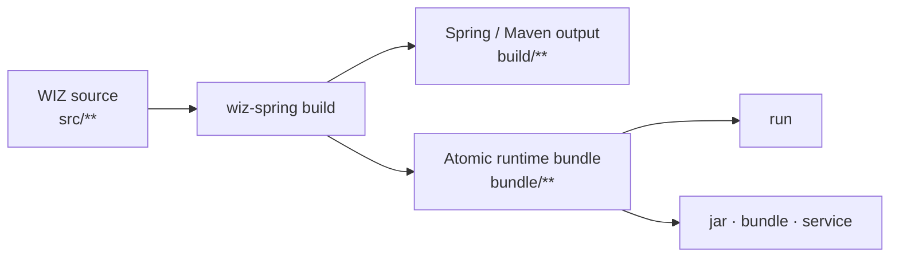

<div align="center">

# WIZ Spring

**Build WIZ apps. Run them on Spring.**

WIZ 소스를 Java 21과 Spring Boot 위에서 빌드하고, 실행하고, 배포하는 올인원 runtime & CLI

<p>
  <a href="https://github.com/season-framework/wiz-spring/tags"></a>
  
  
  <a href="./LICENSE"></a>
  
</p>

<p>
  <a href="#quick-start">Quick Start</a> ·
  <a href="#how-it-works">How it works</a> ·
  <a href="#cli-reference">CLI</a> ·
  <a href="#deployment">Deployment</a> ·
  <a href="#documentation">Docs</a>
</p>

</div>

---

WIZ Spring은 WIZ 앱 소스를 표준적인 Spring Boot/Maven 산출물로 재구성하고, 개발부터 배포까지 하나의 CLI로 연결합니다. 하나의 workspace가 하나의 앱 소스를 갖는 단순한 구조를 사용합니다.

## Highlights

- **WIZ-native, Spring-powered** — 익숙한 WIZ의 App, Route, Model, Portal 구조를 Java/Spring runtime으로 실행합니다.
- **One CLI, end to end** — workspace 생성, 빌드, 실행, JAR 패키징, bundle, systemd 서비스까지 한 흐름으로 처리합니다.
- **Safe by default** — 실패한 빌드는 마지막 정상 bundle을 보존하고, 실행 전 workspace와 build marker를 검증합니다.
- **Production essentials included** — Actuator health, OpenAPI, Swagger UI, request ID, rolling log, CycloneDX SBOM을 기본 제공합니다.
- **AI-ready workspace** — `create`만으로 Codex 설정, 개발 지침, standalone MCP 서버 구성이 함께 준비됩니다.

## Quick start

> [!NOTE]
> JDK 21 이상이 필요합니다. Angular frontend를 빌드하려면 Node.js 20.19 이상 또는 22.12 이상도 준비하세요. Maven은 저장소에 포함된 Wrapper를 사용합니다.

### 1. Runtime 빌드 & alias 설정

```bash
git clone https://github.com/season-framework/wiz-spring.git
cd wiz-spring
./mvnw clean package

export WIZ_RUNTIME_JAR="$PWD/target/wiz-spring-0.2.7.jar"
alias wiz-spring='java -jar "$WIZ_RUNTIME_JAR"'

wiz-spring --version
```

이제 현재 shell에서는 `java -jar ...` 없이 `wiz-spring <command>` 형식으로 실행할 수 있습니다.

<details>
<summary><strong>Bash/Zsh에서 alias 계속 사용하기</strong></summary>

아래 설정을 `~/.bashrc` 또는 `~/.zshrc`에 추가합니다. JAR 경로는 `pwd`로 확인한 실제 절대 경로로 바꾸세요.

```bash
export WIZ_RUNTIME_JAR="/absolute/path/to/wiz-spring/target/wiz-spring-0.2.7.jar"
alias wiz-spring='java -jar "$WIZ_RUNTIME_JAR"'
```

설정을 저장한 뒤 새 terminal을 열거나 현재 shell에 다시 불러옵니다.

```bash
# Bash
source ~/.bashrc

# Zsh
source ~/.zshrc
```

version을 올려 새 JAR을 빌드했다면 `WIZ_RUNTIME_JAR` 경로도 함께 갱신해야 합니다. alias는 interactive shell 전용이므로 shell script와 systemd에서는 실행 파일의 절대 경로를 사용하세요.

</details>

### 2. Workspace 생성

```bash
wiz-spring create ../hello-wiz \
  --package com.example.hello
```

기본 sample workspace를 만들고 clean build까지 실행합니다. 기존 소스를 가져올 때는 `--path <directory>` 또는 `--uri <git-url>`을, 생성만 할 때는 `--skip-build`를 사용하세요.

### 3. 실행

```bash
wiz-spring run \
  --root ../hello-wiz \
  --port 3000
```

| Endpoint | URL |
| --- | --- |
| App | <http://localhost:3000> |
| Health | <http://localhost:3000/actuator/health> |
| OpenAPI | <http://localhost:3000/v3/api-docs> |
| Swagger UI | <http://localhost:3000/swagger-ui.html> |

> [!TIP]
> `run`, `build`, `jar`, `bundle`, `mcp`의 `--root`는 생략할 수 있습니다. 현재 경로에서 `config/wiz.yml`을 찾아 workspace를 자동 감지합니다.

## How it works



1. `create`가 sample 또는 가져온 소스를 준비하고 `.codex`, `.github`, workspace metadata를 설정합니다.
2. `build`가 WIZ 소스를 재구성하고 Java와 Angular를 컴파일합니다.
3. 완료 marker와 SBOM을 포함한 새 bundle이 준비되면 원자적으로 게시합니다.
4. `run`은 runtime 버전과 Java package가 일치하는 정상 bundle만 실행합니다.

## CLI reference

Quick Start의 alias를 등록했거나 Docker 이미지를 사용한다면 `wiz-spring` 명령을 바로 실행할 수 있습니다.

| Command | Description |
| --- | --- |
| `create <path> --package <package>` | 새 workspace를 만들거나 `--path`, `--uri`의 소스를 가져옵니다. |
| `build [--root <path>] [--clean]` | source 재구성, compile, frontend build, bundle 생성을 수행합니다. |
| `run [--root <path>] [--port <port>]` | 검증된 bundle을 실행합니다. 기본 profile은 `dev`입니다. |
| `jar [--root <path>] [--output <jar>]` | workspace를 단일 executable JAR로 패키징합니다. |
| `bundle [--root <path>] [--output <dir>]` | build된 runtime bundle과 config를 배포 디렉터리로 복사합니다. |
| `service <command>` | Linux systemd 서비스의 설치, 조회, 시작, 중지, 로그를 관리합니다. |
| `kill [--dry-run]` | 실행 중인 WIZ Spring process를 조회하거나 종료합니다. |
| `mcp [--root <path>]` | `wiz-spring` MCP stdio 서버를 실행합니다. |
| `completion <bash\|zsh>` | 현재 CLI에 맞는 shell completion script를 출력합니다. |

전체 옵션은 CLI 자체가 가장 정확합니다.

```bash
wiz-spring --help
wiz-spring build --help
wiz-spring service --help
```

<details>
<summary><strong>Shell completion</strong></summary>

현재 shell에 바로 적용할 수 있습니다.

```bash
# Bash
source <(wiz-spring completion bash)

# Zsh
source <(wiz-spring completion zsh)
```

설명 패널이나 색상을 끄려면 `WIZ_SPRING_COMPLETION_HELP=false`, `WIZ_SPRING_COMPLETION_COLOR=false` 또는 표준 `NO_COLOR=1`을 사용하세요.

</details>

## Workspace

```text
hello-wiz/
├── .codex/                 # MCP와 Codex workspace 설정
├── .github/                # 내장 개발 지침과 문서
├── config/
│   ├── application.yml
│   ├── application-dev.yml
│   ├── application-prod.yml
│   ├── application*.example.yml
│   └── wiz.yml             # Java workspace marker
├── src/
│   ├── app/
│   ├── controller/
│   ├── model/
│   ├── portal/
│   ├── route/
│   └── angular/
├── build/                  # 생성된 Spring Boot / Maven project
├── bundle/                 # runtime이 읽는 실행 산출물
├── devlog/
├── devlog.md
└── pom.xml                 # 앱 Java dependency
```

`src/**`와 `pom.xml`이 개발자가 관리하는 핵심 입력입니다. `build/**`와 `bundle/**`은 WIZ Spring이 관리하므로 직접 수정하지 마세요.

<details>
<summary><strong>WIZ Java source convention</strong></summary>

| Source | Role |
| --- | --- |
| `src/app/{appId}/api.java` | App API |
| `src/app/{appId}/socket.java` | App socket |
| `src/route/{routeId}/route.java` | HTTP route |
| `src/controller/**/*.java` | Controller hook |
| `src/model/**/*.java` | Model, Struct, service |
| `src/portal/{package}/**` | Reusable portal package |

package 선언이 없는 Java source에는 `wiz.java.package-root` 기준 package가 build 단계에서 자동으로 추가됩니다.

</details>

## Configuration

설정은 뒤에 있는 값이 앞의 값을 덮어쓰는 순서로 병합됩니다.

1. WIZ Spring 기본값
2. `config/application.yml`
3. `config/application-<profile>.yml`
4. `--host`, `--port`, `--profile` 같은 CLI 옵션

`wiz-spring run`은 기본으로 `dev`, standalone app JAR은 기본으로 `prod` profile을 사용합니다. `prod`의 session cookie는 HTTPS를 전제로 `Secure=true`가 적용됩니다.

> [!WARNING]
> 실제 `application*.yml`은 credential을 포함할 수 있어 기본적으로 Git에서 제외됩니다. 공유할 값은 `application*.example.yml`에 작성하세요. `jar`와 `bundle`은 실제 config를 산출물에 포함하므로 배포 전 secret 포함 여부와 artifact 접근 권한을 확인해야 합니다.

## Deployment

### Executable JAR

```bash
wiz-spring jar \
  --root ../hello-wiz \
  --output ./hello-wiz.jar

java -jar ./hello-wiz.jar
```

### Runtime bundle

```bash
wiz-spring bundle \
  --root ../hello-wiz \
  --output ./hello-wiz-bundle
```

### systemd

```bash
wiz-spring service install hello-wiz \
  --root /srv/hello-wiz \
  --command /usr/local/bin/wiz-spring

wiz-spring service logs hello-wiz --lines 200 --follow
```

서비스는 기본적으로 workspace 소유자로 실행됩니다. build와 service의 운영체제 사용자를 맞추고, 실행 명령은 alias가 아닌 절대 경로로 고정하는 것을 권장합니다.

### Docker

개발 도구와 sample workspace가 포함된 runtime 이미지를 바로 만들 수 있습니다.

```bash
./build.sh runtime
./run.sh

curl http://127.0.0.1:3334/actuator/health
```

workspace를 host에 유지하려면 bind 이미지를 사용합니다.

```bash
./build.sh bind
./run-bind.sh

# 기본 data 위치: ./.wiz-data-bind/app
```

`IMAGE`, `VERSION`, `PLATFORM`으로 build를, `CONTAINER_NAME`, `HOST_HTTP_PORT`, `HOST_SSH_PORT`, `DATA_ROOT`로 실행 환경을 조정할 수 있습니다. SSH는 공개키 인증만 허용합니다.

## Production checklist

- Git에는 `src/`, `pom.xml`, `config/wiz.yml`, `config/application*.example.yml`, `src/angular/package-lock.json`을 포함합니다.
- 실제 config, `data/`, `build/`, `bundle/`은 source와 분리해 관리합니다.
- runtime 버전과 source revision을 고정하고 새 checkout에서 `build --clean`을 먼저 수행합니다.
- 배포 전 `bundle/.wiz-build.json`과 health endpoint를 확인합니다.
- 실행 중인 checkout을 직접 갱신하기보다 release 디렉터리를 분리해 rollback 경로를 유지합니다.

## AI & MCP

`create`는 별도 명령 없이 다음 항목을 workspace에 설정합니다.

- `.codex/config.toml`과 `.codex/AGENTS.md`
- `.github`의 WIZ Spring 개발 지침, API 문서, prompt
- 현재 runtime JAR을 사용하는 `wiz-spring` MCP 서버

MCP 서버만 직접 실행할 수도 있습니다.

```bash
wiz-spring mcp --root ../hello-wiz
```

## Documentation

| Guide | What you will find |
| --- | --- |
| [Web development guide](src/main/resources/wiz/codex-instructions/devdocs/web-development-guide/README.md) | App, Controller, Model, Route, Angular, Portal 작성법 |
| [Runtime API reference](src/main/resources/wiz/codex-instructions/devdocs/wiz-docs/api-reference.md) | `WizContext`, response, session, socket 사용 예제 |
| [Configuration profiles](src/main/resources/wiz/codex-instructions/devdocs/instructions/configuration-profiles.md) | profile과 설정 파일 운용 방식 |
| [Release notes](release-log/README.md) | 버전별 변경 사항과 migration 안내 |
| [Build performance](docs/reviews/eegvhudvcsffxtopyqfcsfdwvzddwcyz-performance.md) | 반복 build benchmark와 재현 방법 |

질문과 버그 제보는 [GitHub Issues](https://github.com/season-framework/wiz-spring/issues)를 이용해 주세요.

## Development

```bash
# Unit & integration tests
./mvnw test

# 실제 브라우저 기반 Angular regression test
node scripts/verify-angular-platform-browser.mjs
```

변경 전후 테스트 결과와 재현 가능한 설명을 함께 남겨 주세요.

## License

WIZ Spring is open source software licensed under the [MIT License](LICENSE).
